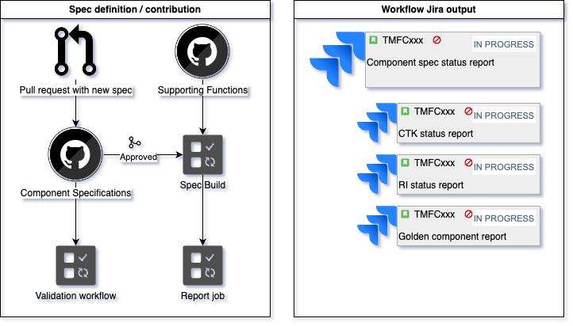
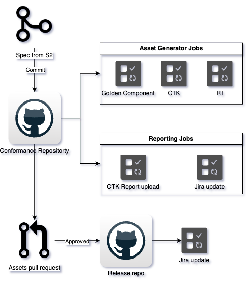

# Welcome To The TMForum ODA Specification
**Project:** TMForum ODA

**Program:** Open Digital Architecture

**Project Status:** Active

## Table of Contents
- [Welcome to the TMForum ODA Specification](#welcome-to-the-tmforum-oda-specification)
  - [For Our Team Members](#for-our-team-members)
  - [Getting Started](#getting-started)
- [TMForum ODA Component Factory](#tmforum-oda-Component-actory)
  - [ODA Teams](#oda-teams)
  - [Repositories](#repositories)
  - [Introduction](#introduction)
  - [Usage](#usage)
  - [Workflow Definition](#Workflow-Definition)
    - [Step 1](#Step-1)
    - [Step 2](#Step-2)
  - [Contact](#Contact)
  - [Need Help?](#Need-Help)

## For Our Team Members

As members of the ODA spec team, you are the driving force behind this project. Here, you'll find all the necessary resources, documentation, and tools to contribute effectively to the TMForum ODA. We value your insights and contributions, and we're excited to see how we can grow and evolve together.

## Getting Started
1. **Familiarize Yourself with the Project:** Begin by reading through our [documentation]() to understand better.
2. **Contribute:** Check out our [contribution guidelines]() on how to propose changes or improvements.
3. **Stay Informed:** Keep up with the latest updates and changes in [Open Digital Architecture]().
4. Check out TMF [documents]() related to this repository.

# TMForum ODA Component Factory
## ODA Teams
- Components
- Technical Architecture
- Canvas 
- Conformance

## Repositories
- Component Specs: [https://github.com/tmforum-rand/TMForum-ODA-Component-Specification](https://github.com/tmforum-rand/TMForum-ODA-Component-Specification)
- Canvas Spec: [https://github.com/tmforum-rand/TMForum-ODA-Canvas-Specification](https://github.com/tmforum-rand/TMForum-ODA-Canvas-Specification)
- Conformance: [https://github.com/tmforum-rand/TMForum-ODA-Component-Conformance](https://github.com/tmforum-rand/TMForum-ODA-Component-Conformance)
- Releases: [https://github.com/tmforum-rand/TMForum-ODA-Ready-for-publication](https://github.com/tmforum-rand/TMForum-ODA-Ready-for-publication)

## Introduction
The Component factory is the name given to the processes that implement the CI/CD development lifecycle of Component assets. 

The releasable assets are:
- Golden Component definitions, 
- CTK's (Conformance Tests)
- Deployable reference implementation. (Component envelopes)

There are three main phases each one is responsible in producing a complete asset which will be used an input for the next phase. Each phase will publish progress status reports that will inform the status of each Component. 

Workflow steps are described in more detail in the workflow definition below.

## Terminology:
- **RI**: Reference Implementation. This term is used to refer to a sample deployable code of a TMForum specification.
- **CTK**: Conformance Test Kit. This is a software package designed to test an implementation of a TMForum specifications and product and report with the test results used for conformance/compliance.

## Dependencies
There are two file dependencies in order to publish a **Golden Component**.
- **Component spec:** This file contains the metadata and core functions of a Component. This is maintained by the components team.
- **supporting functions:** This file contains the security and management functions which are shared across all components 

Golden components are used to auto generate **Component CTK's** and **reference implementations**.

## Usage
To build a Component users only need to interact with two repositories which are managed by different teams. Contributions are made by opening pull requests which will be validated by their respective teams before merging. 

First the **Component spec** has to be produced and can be contributed to the **canvas spec** repository via pull requests. 
Contributions to the **Supporting functions** must be done in the file `supportingFunctions.yaml` under `src/supporting-functions`

Apart from the pull requests to contribute to the Component spec or supporting functions there are a set of validation jobs which will validate the spec before merging into the correct branch which will depend on the version of the asset.

The versioning approach is a combination between semantic versioning and grouping based on api stability.

For example each version v1, v2, may have different branches depending on stability. 
This will be refered too as v1alphaX, v1BetaX etc.

Contributions for each of the versions available will be done in the branches named with the same versions as the asset.
For example a **v1beta1** asset will go to the branch **v1beta2** in the **components spec** repository

## Workflow Definition
Here we describe a general picture of how the full pipeline works. How it is connected and how the data flows inside it.
It is implemented using github actions which are triggered when committing to the github repositories. 

Pull requests are used for previewing and filtering the changes before merging and publishing the specifications.
### Step 1 
This step is responsible of producing a **Component spec**. This is a two step process. First a pull requests must be raised which triggers a validation job. Once the validation has succeeded and the spec has been approved it will be merged. Second process is triggered by merging a validated spec to a branch in the **Component spec** repository. This will trigger the following jobs:
1. **Spec build:** This merges the spec and supporting functions to create a Golden Component which will be used for generation of **conformance** assets.
2. **Report:** This job is responsible for reporting the result of the merging. The job will create a hierarchy of issues in Jira to track each of the components to be published and its assets.   

### Step 2
In this step Component assets are generated and tested. Once a spec has been approved the following assets will generated:
- **Golden Component**: This is the complete build of the Component with the core and supporting functions.
- **CTK**: Conformance testing software to validate implementations of a Component spec.
- **RI**: This is an example implementation of the spec which has been validated by the previous ctk.
The output gathered through this pipeline will be used to automatically update Jira for development reporting.

## Contact
For any issues with the pipeline contact this email for support: vmarirodriguez@tmforum.org

## Need Help?
**Members:** Please reach out via the following channels for support or questions.
- Our ODA slack **[channel]()**
- The TMForum Community **[forum](https://engage.tmforum.org/communities/allcommunities)**

For **External Contributors:** We are currently in the process of establishing a dedicated contact point for your valuable contributions and inquiries. In the meantime, please feel free to open an issue on our GitHub repository for any questions or feedback you might have. We appreciate your interest and patience, and we look forward to engaging with you soon.

## Provide Feedback
We highly value your insights and perspectives! If you have suggestions for improvements or notice any issues, please feel free to contribute. To submit your feedback, create a pull request with your proposed changes or enhancements. Detailed instructions for submitting pull requests can be found [here](). Your input is crucial in helping us refine and enhance this documentation, ensuring it remains a dynamic and useful resource for everyone. Don't hesitate to share your ideas - every piece of feedback is an opportunity for us to grow together.