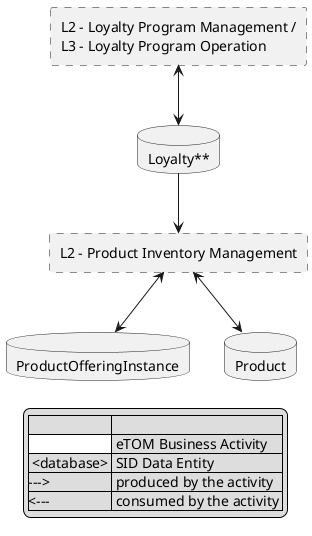

# Diagram construction reference

All five diagrams below are shown worked through for **TMFC005 – Product Inventory**, the component this
reference was originally validated against, and re-validated on a second, quite different component,
**TMFC010 – Resource Catalog Management** (6 eTOM activities, 4 SID entities, 12 links in the eTOM–SID
diagram, all bidirectional — versus TMFC005's 2 eTOM boxes, 3 SID entities, 4 links, one one-directional).
The patterns generalize to any `TMFCxxx` component — swap in that component's own YAML content — but the
specific box labels and links quoted here are TMFC005's unless noted otherwise. Findings from the TMFC010
pass are folded in below (an XML-escaping bug in the SVG script, and a previously-undocumented rule for
collapsing multi-level eTOM entries into one box).

## Parsing componentMetadata lists

`componentMetadata.eTOMs`, `.SIDs`, and `.functionalFrameworkFunctions` are all lists of pipe-delimited
strings. Each needs a different split:

**eTOMs** — `<L2-or-deeper ID>|<Activity_Name>|<version>`, e.g. `1.2.11|Product_Inventory_Management|v24.0`.
- ID and version are the first/last tokens; drop the version for display, keep it for the References
  table.
- **Level** is *not* stored explicitly — infer it from how many dot-separated segments the ID has:
  `segments = id.split('.'); level = "L" + str(len(segments) - 1)`. Check against TMFC005's own set: `1.2.11`
  → 3 segments → L2 (correct — matches "L2 - Product Inventory Management" in the existing PDF diagram).
  `1.1.19` → 3 segments → L2. `1.1.19.2` → 4 segments → L3. `1.1.19.2.5` → 5 segments → L4. This formula is
  what makes the level column mechanical instead of guessed.
- Name: replace underscores with spaces (`Product_Inventory_Management` → `Product Inventory Management`);
  keep any literal `&` as-is (e.g. `Resource_Specification_Development_&_Retirement` →
  `Resource Specification Development & Retirement`, seen in TMFC010) — don't strip or escape it in the
  Markdown table, but do XML-escape it if it ends up in an SVG (see the API context diagram section below).

**Collapsing multi-level eTOM entries for the two diagrams (2.3 and 3.1) specifically** — the full table in
2.1 always lists every level (L2, L3, L4...) as its own row, but both diagrams that draw eTOM activities as
boxes (eTOM–SID links, API context) should show **one box per top-level (L2) entry**, not one box per YAML
row. If an L3/L4 descendant shares an L2 ancestor already in the list, fold it into that ancestor rather
than drawing it separately:
- TMFC005: `1.1.19` (L2) and `1.1.19.2` (L3, its child) collapse into one box; `1.1.19.2.5` / `1.1.19.2.7`
  (L4 grandchildren) aren't boxed separately either.
- TMFC010: `1.5.3` (L2) and `1.5.3.4` (L3, its child) collapse — but here the *existing PDF's own*
  eTOM–SID diagram doesn't even merge the child's name into the label (the box just says
  "L2 - Resource Specification Development & Retirement", full stop). Match whatever the PDF actually
  shows for section 2.3 (see "eTOM–SID diagram" below); for the API context diagram (3.1), which has no PDF
  to match, default to the simpler one-box-per-L2-id-and-name approach and don't merge child names into
  the label — it's less to get wrong and reads just as clearly.

**SIDs** — `<Domain>|<ABE tokens...>|<version>` — domain and version are always first/last; most entries
have one or two ABE tokens in between, but a few (see below) have more. Drop the domain and version, then:
- If one ABE token remains: that's SID ABE Level 1, Level 2 is blank.
- If two ABE tokens remain: the first is Level 1, the second is Level 2.
- If **more than two** ABE tokens remain (seen in TMFC037/TMFC038's `Patterns_Domain` entries, e.g.
  `Patterns_Domain|Performance_ABE|Performance_Monitoring_ABE|Performance_Production_ABE|MeasurementProductionJob_BE|v25.0`
  — 4 ABE tokens): use the **first** token for Level 1 and the **last** (leaf) token for Level 2, dropping
  the intermediate classification tokens — this keeps the table's two columns populated with the broad
  grouping and the actually-distinguishing leaf entity, rather than losing the leaf distinction by truncating
  to the first two tokens (a real generated `.md` elsewhere in the repo did exactly that truncation and ended
  up with three visually-identical rows for three different SID entities — treat that as a bug to avoid
  repeating, not a precedent to follow).
- Strip a trailing `_ABE`/`_BE` **or ` ABE`/` BE`** (a space instead of an underscore before the suffix —
  seen in TMFC038's own `SIDs` list, e.g. `Performance_Threshold ABE` and `Performance_Monitoring ABE`,
  inconsistently punctuated versus the more common `Performance_Threshold_ABE` form used elsewhere in the
  same list) from each token, then replace remaining underscores with spaces. A regex like
  `re.sub(r"[ _](ABE|BE)$", "", token)` handles both punctuation variants in one step — don't match only
  `_ABE` literally, or the space-punctuated tokens silently keep a dangling "ABE"/"BE" word in the rendered
  table.
  **Do not** camelCase-split a token that has no underscores (e.g. `ResourcePerformanceSpecification_BE` →
  `ResourcePerformanceSpecification`, not `Resource Performance Specification`) — confirmed against TMFC010's
  already-validated table, which keeps such tokens as one word.

Worked example from TMFC005's `SIDs` list:
```
Product_Domain|Product_and_Offering_Instance_ABE|Product_ABE|v25.0
  → L1 "Product and Offering Instance", L2 "Product"
Product_Domain|ProductOfferingInstance_ABE|v25.0
  → L1 "ProductOfferingInstance", L2 (blank)
Product_Domain|Loyalty_ABE|Loyalty_Program_ABE|v25.0
  → L1 "Loyalty", L2 "Loyalty Program"
```

Worked example from TMFC037's `SIDs` list (the 4-ABE-token case):
```
Patterns_Domain|Performance_ABE|Performance_Monitoring_ABE|Performance_Production_ABE|MeasurementProductionJob_BE|v25.0
  → L1 "Performance", L2 "MeasurementProductionJob"
Patterns_Domain|Performance_ABE|Performance_Monitoring_ABE|Performance_Collection_ABE|AdhocCollection_BE|v25.0
  → L1 "Performance", L2 "AdhocCollection"
```
This won't necessarily match an older checked-in PDF's SID table word-for-word (TMFC005's existing PDF
shows a slightly different, hand-curated split) — that's expected. The YAML is the source of truth per
`SKILL.md`; a mechanical, documented rule beats trying to reverse-engineer an old table.

**functionalFrameworkFunctions** — `<numeric ID>|<Function_Name>|<version>`, e.g.
`180|Assigned_Products_Maintenance|v24.0`. Same underscore-to-space treatment for the name. There's no
level concept here.

## eTOM/Functional Framework descriptions (sections 2.1 and 2.4 — prose in a hand-maintained lookup file, not inferred)

Same class of problem as the eTOM–SID diagram below: `componentMetadata.eTOMs` and
`.functionalFrameworkFunctions` are ID/name/version only, and nothing in the YAML holds the descriptive prose
(or, for Functional Framework Functions, the two Aggregate Function Level columns) that the
officially-published component document's own 2.1/2.4 tables show. That text lives in the eTOM/Functional
Framework standards themselves, not in this component's data — so it goes into a hand-maintained lookup
file, the same as the Links file below, not derived from YAML.

**Precedence between the two available sources (standing rule, identical for eTOM and FF)**: the
component's own `TMFCnnn` document wins for any ID it covers, *even where its wording differs from the
framework spreadsheet's* — that difference is expected and is not to be reconciled. Where the `TMFCnnn`
document has no description for an ID, take the framework spreadsheet's default (next section). Only when
neither source has the ID does the cell get `*(no description available)*`.

### Sourcing descriptions from the framework spreadsheets

The official framework workbooks are on disk, covering every release from v23.0 to v26.0:

```
C:\Users\HugoVaughan\OneDrive - TM Forum\Apps\ODA Component Editor\frameworks\
    GB921_Business_Process_Framework_Processes_Excel_v<ver>.xlsx    <- eTOM (section 2.1)
    GB1033[F]_Functional_Framework_Excel[_Format]_v<ver>.xlsx       <- Functional Framework (section 2.4)
    GB922_Information_Framework_SID_Excel_v<ver>.xlsx               <- SID
```

This is what makes the precedence rule above workable for a component with no published document at all —
there is always a default available, so `*(no description available)*` should be rare.

**Look each ID up in the release its own YAML entry pins it to, not one blanket release.** Every
`componentMetadata` entry carries its own version suffix and a component's list is often mixed (TMFC003 has
39 Functional Framework entries at `v25.5` and 2 at `v23.0`). The same ID can exist in several releases with
different wording — function `208` does — so a single-workbook lookup silently returns the wrong revision.

**eTOM — GB921**: the functions sheet is *version-named*, e.g. `eTOM25,5` (note the comma), so find it by
`eTOM` prefix while excluding `eTOM Deleted`. Key on `Process identifier` (`1.3.3`, `1.4.5.6`). Use the
**`Brief description`** column — it matches the published component documents' own 2.1 prose almost
verbatim; `Extended Description` is a much longer variant that does not. Expect **duplicate rows for the
same identifier** (one per Domain / Vertical Group) — dedupe by taking the first.

**Functional Framework — GB1033**: sheet layout differs by release.
- `GB1033F` (v24.0+) has a **`Functions and AFs`** sheet with one fully-populated row per function — use it.
  Its plain `Functions` sheet has the AF columns *merged*, so they read as `None` on most rows.
- `GB1033` (v23.x) has only `Functions`, and it is fully populated there.
Key on `Function ID`; description from `Description`; the two Aggregate Function columns from `AF Lev.1` /
`AF Lev.2`.

**Resolve columns by exact normalized header text — never by position, prefix, or substring.** The
`Functions and AFs` sheet puts `AF Lev.1` (the AF *name*) directly beside `AF L1` (a hierarchy id like
`6.7.1`), so a prefix match grabs the wrong column; one sheet also spells a header `AF Lev.2'` with a
trailing apostrophe, so strip that when normalizing. Forward-fill the AF columns as a safety net for merged
cells. Numeric IDs may arrive as floats — coerce `208.0` to `"208"` before keying.

**A dangling ID is a real finding.** TMFC003's `720|Customer_Order_Searching|v23.0` is absent from *every*
FF release on disk, so its row legitimately keeps `*(no description available)*`. Report that in the chat
summary as a YAML data-quality issue rather than substituting a similarly-named function.

When a lookup file mixes both sources, say so in its `Source:` line (which component doc, which spreadsheet
releases) so provenance travels with the file.

### Check for `Diagrams/<ComponentID>_eTOM_Descriptions.md` / `_FF_Descriptions.md` first

Before writing the 2.1/2.4 tables, check whether these two files exist for the component. Once they exist,
**never regenerate, overwrite, or re-derive an existing description** — the transcribed prose is a read-only
input, identical status to the eTOM–SID Links file and the Supplement file, and per the precedence rule it
outranks the framework spreadsheet even where the two disagree.

**Filling a gap is not a regeneration.** Replacing a row that currently reads `*(no description available)*`
with the framework spreadsheet's default is expected and allowed — that's the precedence rule working, not a
violation. Touch only placeholder rows, leave every already-populated row byte-for-byte alone, and update the
file's `Source:` line to name both provenances.

If the two files don't exist yet, create them (next sections) — from the component's published document
where there is one, and from the framework spreadsheets for anything it doesn't cover.

**Format** — a one-line source note, then a pipe table keyed by ID:

`Diagrams/<ComponentID>_eTOM_Descriptions.md`:
```markdown
# TMFC005 eTOM Business Activity Descriptions

Source: transcribed from `TMFC005 Product Inventory v1.1.0.docx`, section 2.1 (eTOM business activities).

| Identifier | Description |
|---|---|
| 1.2.11 | Product Inventory Management is responsible to establish, manage and administer... |
```

`Diagrams/<ComponentID>_FF_Descriptions.md`:
```markdown
# TMFC005 Functional Framework Function Descriptions

Source: transcribed from `TMFC005 Product Inventory v1.1.0.docx`, section 2.4 (Functional Framework Functions).

| Function ID | Function Description | Aggregate Function Level 1 | Aggregate Function Level 2 |
|---|---|---|---|
| 180 | Assigned Products Maintenance permits defining and update... | ProductRepository Management | ProductInventory Repository Management |
```

A component with a genuinely empty table (e.g. TMFC035 has zero eTOM business activities in its own
published doc) gets a "confirmed empty" file instead of a table, same convention as the Links file:

```markdown
# TMFC035 eTOM Business Activity Descriptions

Source: confirmed empty — transcribed from `TMFC035 Permissions Management v1.2.0.docx`'s "2.1 eTOM
business activities" table, which has no rows for this component.
```

Escape any embedded `|` in a description as `\|` (same reasoning as the Links file — an unescaped `|` inside
a cell silently creates phantom extra columns in most Markdown renderers).

### Matching by ID when writing the 2.1/2.4 tables

`Identifier`/`Function ID` in these files match `componentMetadata.eTOMs`/`.functionalFrameworkFunctions`
entries' first pipe-delimited token exactly (e.g. `1.2.11`, `180`) — a direct dictionary lookup, no name
matching or fuzzy logic needed, unlike the Links file's eTOM–SID cross-referencing. If a YAML entry's ID has
no row in the corresponding Descriptions file (the YAML gained an activity/function after the Descriptions
file was transcribed, or the file is genuinely incomplete), fall back to the framework spreadsheet's default
for that ID and add it to the lookup file. Only if the ID is missing from the spreadsheets too does the cell
get `*(no description available)*` — never blank, never invented text; a visible, honest gap beats a silent
one, and at that point the ID itself is suspect and belongs in your chat summary.

### Creating these files for a new component (one-time transcription)

If the component has an officially-published `.docx` (preferred — reliable table extraction via
`python-docx`) or `.pdf`, transcribe its own 2.1 and 2.4 tables verbatim into the two files above; this is a
one-time authoring cost per component, exactly like the Supplement file and the Links file. The 13
components transcribed so far (from the versioned docs in the user's OneDrive `20260716 Completed Component
Docs` folder) used [`scripts/extract_descriptions.py`](../scripts/extract_descriptions.py) — a header-matched
`python-docx` table extractor tolerant of real-world header variance seen across those 13 files (typos like
"Aggegate", pluralization like "Aggregate Functions Level 1", an extra "Sub-Domain Functions Level N" line
prepended to the header, and extra "AF L1/L2 Id" sibling columns in a couple of components) — reuse it rather
than writing a fresh extractor, and extend its header-matching if a new component's table headers don't fit
any of the patterns already tolerated.

Then fill whatever the published document doesn't cover from the framework spreadsheets (see "Sourcing
descriptions from the framework spreadsheets" above). A component with **no** published document at all is
no longer a dead end — build both files entirely from the spreadsheets; there is a default for every ID that
exists in a framework release.

## SID descriptions (section 2.2 — prose in a hand-maintained lookup file, keyed by name pair, not ID)

Same class of problem as the eTOM/Functional Framework descriptions above: `componentMetadata.SIDs` is
ID/name/version only (see "Parsing componentMetadata lists" for how Level 1/Level 2 are derived from it),
and nothing in the YAML holds the ABE definition prose the officially-published component document's own
2.2 table shows. That text lives in `Diagrams/<ComponentID>_SID_Descriptions.md` — already transcribed for
every component in this repo (unlike the eTOM/FF files, which only exist for a subset), so section 2.2
should essentially never fall back to the framework spreadsheet in practice, but the same precedence rule
applies if a gap ever shows up: component doc wins, framework spreadsheet (`GB922_Information_Framework_
SID_Excel_v<ver>.xlsx`) is the default, `*(no description available)*` only if neither has it.

**Format**:

```markdown
# TMFC005 SID Descriptions

Source: `TMFC005 Product Inventory v1.1.4.docx` (Section 2.2) where it documents a definition;
gap-filled from the SID Information Framework spreadsheet for ABEs/Business Entities it omits.

| SID ABE Level 1 | SID ABE L1 Definition | SID ABE Level 2 | SID ABE L2 Definition | Source |
|---|---|---|---|---|
| Product and Offering Instance | Product and ProductOfferingInstance represent... | Product | Represents an instance... | GB922_Information_Framework_SID_Excel_v25.0.xlsx (v25.0) |
```

**Matching is by (Level 1, Level 2) name pair, not by an ID** — SID entries have no stable identifier the
way eTOM/FF entries do, only the two derived display names (see "Parsing componentMetadata lists" for how a
YAML `SIDs` entry becomes those two names). Build a dict keyed on the exact `(SID ABE Level 1, SID ABE Level
2)` tuple from the file (blank Level 2 stays an empty string, matching a YAML entry with no second ABE
token) and look up each parsed YAML row by that same tuple. A file can and does have multiple rows sharing
one Level 1 with different Level 2 values (or a blank one) — that's the same entity family documented at
different levels, not a duplicate to collapse.

Add two columns to the 2.2 table: `SID ABE L1 Definition` and `SID ABE L2 Definition` (looked up
independently — a row can have an L1 definition with no L2 definition, or vice versa, if the source document
only defined one level). Escape embedded `|` the same way as the other description files. If a YAML SID
entry's (L1, L2) pair has no row in the file, that's the rare gap case — check the framework spreadsheet
before writing `*(no description available)*`, and flag it in your chat summary since the file's near-total
coverage means a real miss here is more likely to be a name-derivation mismatch (e.g. the SID-parsing rule
producing a slightly different Level 2 string than what was transcribed) than a genuine absence — recheck
the parsing before concluding the ID is dangling.

## Exposed API / Dependent API diagrams

These already exist as ready-to-use PlantUML in `Diagrams/<ID>_Exposed_API.yaml` and
`Diagrams/<ID>_Dependant_API.yaml` — each file's content *is* an `@startyaml ... @endyaml` block (PlantUML's
built-in nested-data renderer, which is what actually draws the box-and-arrow structure you'd see in the
old PDF's "3.1 Exposed APIs" / "3.2 Dependent APIs" pages). Don't rebuild these as component diagrams —
just read the file and drop its contents into a fenced ` ```plantuml ` block verbatim. The one thing worth
double-checking: these files' `name:` fields are your best source for API display names when writing the
adjacent table (they're already resolved, unlike the bare `id` in the main component YAML).

**Never let a `url` field reach either diagram.** `@startyaml` prints every key in the block as literal
diagram text, so a `specification` entry's `url` (the swagger/OpenAPI link) would render as a long URL
string inside the box. `sync_diagram_yaml.py` strips `url` from every version block before writing these
two files (see `_specification_without_urls()` in the script) — always regenerate through that script
rather than hand-copying a `specification` list out of the main YAML, which would carry `url` straight
through. The main YAML itself keeps its `url` fields untouched; this rule is scoped to what the diagram
displays, not to the source data.

### Past 60 total operations, the file (and diagram) splits into numbered pages

`sync_diagram_yaml.py`'s `sync_all()` bin-packs the API list by `_operation_count(entry)` (total
`GET`/`POST`/... leaf operations across every version/resource of that one API) via `paginate_entries()`,
never splitting one API's own operations across two pages — see "Splitting oversized Exposed/Dependent
API and Events diagrams" in `SKILL.md` for the algorithm. Below 60 total, nothing changes: the plain
`<ID>_Exposed_API.yaml`/`<ID>_Dependant_API.yaml` gets written as always. Above it, you get
`<ID>_Dependant_API_1.yaml`, `_2.yaml`, ... instead, and the main `.md` embeds each page as its own image
in sequence, e.g. TMFC003's real dependent-API list (160 operations, split 56/59/45):

```markdown


*(PlantUML source: [TMFC003_Dependant_API_1.yaml](TMFC003_Dependant_API_1.yaml) — split across 3
diagrams since the full dependent-API list has more than 60 operations combined; see the following two
diagrams for the rest.)*


*(PlantUML source: [TMFC003_Dependant_API_2.yaml](TMFC003_Dependant_API_2.yaml))*


*(PlantUML source: [TMFC003_Dependant_API_3.yaml](TMFC003_Dependant_API_3.yaml))*
```

Only the first page's caption explains the split (so a reader hitting page 2 or 3 cold doesn't need
it re-explained); the rest just cite their own source file, same as an unsplit diagram's caption always
has. Render every numbered `.yaml` into its own `.png` the same way as an unsplit diagram — nothing about
the PlantUML server call changes, there's just more than one call now.

**If you ever hand-edit a Diagrams file instead of going through `sync_all()`, re-run the pagination check
yourself** (`from sync_diagram_yaml import paginate_entries, _operation_count`) rather than assuming a
manual edit stays under 60 — the count is the total across *all* entries, not any single one, so even a
small edit (adding one more API, or a handful of operations to an existing one) can be what tips a
component over the threshold for the first time.

## Events diagrams (Published / Subscribed — regenerated fresh by sync_all(), split from one file)

`sync_all()` (see "Where the data lives" in `SKILL.md`) regenerates `Diagrams/temp/<ID>_Events.yaml`,
`<ID>_Published_Events.yaml`, and `<ID>_Subscribed_Events.yaml` fresh every run, straight from the main
YAML's `coreFunction.publishedEvents`/`.subscribedEvents` — no old-file matching, and (per explicit user
decision) no cross-referencing against `exposedAPIs`/`dependentAPIs` to resolve an `id` or a "cleaner"
display name. `sync_events()`/`_merge_event_entries()` just group the main YAML's own entries by their
raw `name`, merging duplicate version blocks (a v4 and a v5 entry for the same event group) into one
with a de-duplicated `resources` list — that raw `name` is what ends up in the diagram, nothing invented
on top of it. For TMFC005 (whose main YAML entries happen to carry a `name` that already reads as an API
display name), the combined file:

```yaml
@startyaml
publishedEvents:
    - name: Product Inventory Management API
      resources: [...]
subscribedEvents:
    - name: Resource Inventory Management API
      resources: [...]
    ... (more entries)
@endyaml
```

`sync_all()` also writes the two halves as their own standalone `<ID>_Published_Events.yaml` /
`<ID>_Subscribed_Events.yaml` files directly (not something you split out of the combined file by hand)
— reference those two in the document, and treat the combined `<ID>_Events.yaml` as a convenience
artifact, not itself one of the two diagram sources.

**Either half can itself pass the 60-event-name threshold** — `sync_all()` runs `_write_paginated()` on
each half independently, same `_event_count()` metric the API diagrams use, producing
`<ID>_Published_Events_1.yaml`/`_2.yaml`/... (or `<ID>_Subscribed_Events_...`) instead of one file, in
which case embed each page the same numbered way as the Exposed/Dependent API split above. This is fully
automated — there's no manual pagination step for Events anymore.

Keep each entry's original indentation exactly as in the source file — PlantUML's YAML renderer is
whitespace-sensitive the same way real YAML is.

## API context diagram (new — built fresh, purely from YAML, as a generated SVG)

There's no precedent for this one in the old PDF; it's a new synthesis showing the whole component in
context, drawn as a **black box** with a specific, deliberate layout:

- The component itself is a solid black box, sized to comfortably fit everything inside it — don't let it
  shrink-wrap to just the title text.
- Dependent APIs are required-interface sockets, each with its **own straight line** landing at its own
  distinct height, stacked in a column down the **left edge**.
- Exposed APIs are provided-interface lollipops, same treatment, down the **right edge**.
- eTOM activities are dashed rectangles placed **inside** the box, near the top.
- SID entities are cylinders placed **inside** the box, near the bottom.

All of this is derived mechanically from the main YAML, with no manual PDF-reading step needed (contrast
with the eTOM–SID diagram below, which does need one).

**This is the one diagram in the set that is not PlantUML source.** "Each API gets its own straight,
individually-anchored connector" is a precise coordinate-layout requirement, and PlantUML/Graphviz's
automatic layout fundamentally can't deliver it — every same-side edge gets bundled toward roughly one
attachment point on the target node no matter what's tried. Concretely, on this exact diagram: per-edge
`-left-`/`-right-` direction hints misplaced individual nodes unpredictably; `together { }` grouping
collapsed 12 labels onto nearly the same point; a working global-`left to right direction` layout still
funneled every line to a single point on the box once there were more than a handful of same-side spokes,
even with `skinparam linetype ortho` for straight-line routing and a taller box. None of these are
PlantUML misuse — it's a real gap in what Graphviz-style automatic layout can express (it has no concept of
"attach this edge at exactly this height on that node").

So this diagram is generated directly with exact coordinates instead, via
[`scripts/render_api_context_svg.py`](../scripts/render_api_context_svg.py) (relative to this skill's root).
Call `build_svg(component_id, component_name, dependent_apis, exposed_apis, etom_entries, sid_entries)` —
`dependent_apis`/`exposed_apis` are lists of `{"id": ..., "name": ...}`, `etom_entries`/`sid_entries` are
label strings (`\n` for a second line) — and write the result to `Diagrams/<ID>_API_Context.svg`. The
script sizes the box height to `max(len(dependent_apis), len(exposed_apis)) * 60px`, and also checks it's
tall enough for the nested eTOM/SID content, so it grows automatically as a component's API count grows —
no per-component tuning needed the way the PlantUML attempts required.

Embed the SVG directly in the Markdown (``, no `Diagrams/`
prefix — the main `.md` lives inside `Diagrams/` itself, see `SKILL.md` "Where the data lives") — it
renders natively in Markdown viewers, no PNG conversion needed. If a PNG is specifically required and no
`cairosvg`/`rsvg-convert` is available, `svglib` (pure Python) → `reportlab.graphics.renderPDF` → `pymupdf`
rasterizing that one-page PDF works with no native dependencies; see `SKILL.md` for the exact snippet.
Always render and actually look at the result before finalizing — for TMFC005 this surfaced a labeling
detail worth double-checking each time: confirm eTOM ended up above SID and not the reverse, since which
end of a list lands "near the top" is exactly the kind of thing that's easy to get backwards when adapting
the script's entry order for a new component.

The script XML-escapes all label text it's given (fixed after testing on TMFC010, whose
`Resource Specification Development & Retirement` eTOM name has a bare `&` that was silently swallowed by
the SVG parser before the fix) — you don't need to pre-escape entries yourself when calling `build_svg`,
just pass the plain text.

Full worked example for TMFC005 (all 12 dependent APIs) is at
[`test-outputs/Diagrams/TMFC005_API_Context.svg`](../test-outputs/Diagrams/TMFC005_API_Context.svg)
alongside this skill.

## eTOM–SID diagram (2.3 — links stored in a hand-maintained Links file, not inferred)

This is the one diagram in this document that genuinely can't be generated from YAML alone, and shouldn't
be faked. `componentMetadata.eTOMs` and `.SIDs` are two independent flat lists — nothing in the YAML says
*which* eTOM activity links to *which* SID ABE, or in which direction.

### Check for `Diagrams/<ComponentID>_eTOM_SID_Links.md` first — don't touch the PDF if it exists

Before doing anything else for this diagram, check whether `Diagrams/<ComponentID>_eTOM_SID_Links.md`
already exists for this component. This file is the authoritative, hand-maintained record of the link
table, with the exact same status as the Supplement file (see SKILL.md's "Supplement file" section): once
it exists, **never regenerate, overwrite, or re-derive it from the PDF again** — treat it strictly as a
read-only input. If it exists, read its link table directly and skip straight to rendering (PlantUML or
SVG, per the size threshold below); the original PDF is irrelevant for this diagram from that point on.

The file has a one-line source note plus a 5-column table, in this shape:

```markdown
# TMFC005 eTOM–SID Links

Source: transcribed from the original PDF's "2.3 eTOM L2 - SID ABEs links" diagram.

| eTOM activity | SID ABE | Direction | YAML eTOM | YAML SID |
|---|---|---|---|---|
| L2 - Product Inventory Management | ProductOfferingInstance | bidirectional | 1.2.11\|Product_Inventory_Management\|v24.0 | Product_Domain\|ProductOfferingInstance_ABE\|v25.0 |
| L2 - Product Inventory Management | Product | bidirectional | 1.2.11\|Product_Inventory_Management\|v24.0 | Product_Domain\|Product_and_Offering_Instance_ABE\|Product_ABE\|v25.0 |
| L2 - Product Inventory Management | Loyalty | activity consumes | 1.2.11\|Product_Inventory_Management\|v24.0 | Product_Domain\|Loyalty_ABE\|Loyalty_Program_ABE\|v25.0 |
| L2 - Loyalty Program Management / L3 - Loyalty Program Operation | Loyalty | bidirectional | 1.1.19\|Loyalty_Program_Management\|v24.0; 1.1.19.2\|Loyalty_Program_Operation\|v24.0 | Product_Domain\|Loyalty_ABE\|Loyalty_Program_ABE\|v25.0 |
```

**The first three columns (`eTOM activity`, `SID ABE`, `Direction`) are the hand-maintained link data** —
everything "never regenerate, overwrite, or re-derive" (above) refers to. **The last two columns
(`YAML eTOM`, `YAML SID`) are a derived cross-reference, recomputed every time the file is read** (see
"Every time an existing Links file is read..." below) — they are not part of the hand-authored record, and
rewriting them (with the file's other content otherwise untouched) is expected on every run, not a violation
of "never regenerate."

**Direction** is always exactly one of three values — normalize to these, don't invent phrasings or use
arrow symbols (`<-->`, `-->`, `<--`) or name the specific entity inline:
- `bidirectional`
- `activity produces` (arrow points from the eTOM activity toward the SID ABE)
- `activity consumes` (arrow points from the SID ABE toward the eTOM activity)

**YAML eTOM / YAML SID** hold the *exact* matching entry (or entries) from the component's current
`componentMetadata.eTOMs` / `.SIDs`, copied verbatim as the raw pipe-delimited string (`ID|Name|version` for
eTOM, `Domain|ABE[|BE]|version` for SID) — **escape every embedded `|` as `\|`** so the table still parses
as 5 columns (a raw, unescaped `|` inside a cell silently creates phantom extra columns in most Markdown
renderers — confirmed to actually break tables, not just a theoretical risk). A combined-box row (multiple
eTOM activities merged into one visual box, e.g. the "L2 - X / L3 - Y" pattern above, or several L2s sharing
one box) gets multiple YAML entries joined with `; `. A SID ABE that belongs to a *different* component
(named like `Product (TMFC005 - Product Inventory)` in the `SID ABE` column) gets `external
(cross-component)` in the `YAML SID` column instead of a local match — it's correctly absent from this
component's own YAML, that's not an error.

### Which component a cross-component SID ABE is depicted under: `Common_Component_SID_owner_Links.md`

When a `SID ABE` cell is flagged `external (cross-component)`, don't guess which other component's box it
belongs under — look it up in `docs/Common_Links/Common_Component_SID_owner_Links.md`, which lives once at
the repo root (sibling to `specifications/`, not per-component like the Links file above). It's maintained
through the Component Specification Studio app's "Common Component–SID owner links" editor and consolidates
this one cross-component fact for every SID ABE in the whole spec suite: which component's box a given SID
entity is drawn under when it isn't its own component's. Two columns:

```markdown
| Depicted under component | SID element as present in the YAML file |
|---|---|
| TMFC001 - ProductCatalogManagement | Product_Domain\|Product_Specification_ABE\|v26.0 |
```

**Match on the `Domain|ABE[|BE]` token path only — ignore the version suffix on both sides.** Per explicit
user instruction, treat every row in this file as true for all versions of the frameworks, not just the
one its own row happens to be pinned to. A component's own `SIDs` entry for the same ABE is very often on a
different framework release than whatever version this file's row was last written at (the same lagging-
version pattern documented elsewhere in this skill) — that's expected, not a mismatch to resolve, and it
must never produce a `**NO MATCH**` on version grounds alone. Strip the trailing `|v<ver>` from the file's
`SID element` column the same way you already strip it from a component's own `SIDs` entries, then compare
the remaining `Domain|ABE[|BE]` tokens for equality.

**Rows can legitimately repeat the same component/SID pair** — this file's own editor deliberately applies
no duplicate-pair check, unlike every other Common-Links table — so don't treat a repeated row as an error
or collapse it.

When a match is found, use its `Depicted under component` value (already in `TMFCxxx - ComponentName`
form) as the `external (cross-component)` annotation in the eTOM–SID Links file and in the rendered
diagram's box label, instead of leaving a bare `external (cross-component)` with no component named. If the
SID ABE genuinely isn't in this file yet, leave the annotation as the bare `external (cross-component)` and
flag the gap in your chat summary rather than inventing an owning component.

For a component that genuinely has no eTOM–SID diagram — no eTOM/SID entries in the YAML at all, or the
original PDF's page 2.3 turns out to be blank — still create the file, just recording that fact instead of
a table (no columns to add here, since there's no table):

```markdown
# TMFC055 eTOM–SID Links

Source: confirmed empty — the original PDF's "2.3 eTOM L2 - SID ABEs links" page has no diagram (no image,
no vector drawings). No eTOM–SID diagram should be generated for this component.
```

Writing a "confirmed empty" file matters as much as a populated one: without it, a future run has nothing
to stop it from re-inspecting the PDF and re-risking a misread — this is exactly how TMFC055 ended up with
a fabricated link in an earlier session (a connector with no basis in the source, caught and removed later)
before this file existed.

### Every time an existing Links file is read, refresh its YAML eTOM / YAML SID columns — don't just trust stale ones

"Never regenerate" (above) means never re-derive the *link data* (the first three columns) from the PDF
again — it does not mean never touch the file at all. `componentMetadata.eTOMs` and `.SIDs` can change after
a Links file was written (an activity or ABE added, removed, or renamed), and the file has no mechanism of
its own to notice that drift. So every time you read an existing Links file, before using it to render the
diagram:

1. Collapse the current YAML's `eTOMs` to L2 (per "Collapsing multi-level eTOM entries" above) and take the
   current `SIDs` list, same as you would for sections 2.1/2.2. For matching purposes, extract each eTOM
   entry's name from the second-to-last pipe-delimited field (not always index 1 — a malformed entry with
   an extra spliced-in field, like an accidental `Product_Domain` label inside an eTOM row, still has its
   real name right before the version) and each SID entry's name(s) from every field between the domain
   (first) and version (last).
2. For each row's `eTOM activity` cell, split only on `/` that has whitespace on both sides (a combined-box
   separator) — not on a bare `/` embedded in a genuine compound name like `Contact/Lead/Prospect
   Management`, which is one single activity name, not two boxes. Match each piece by name (after stripping
   any `L2 -`/`L3 -` prefix and leading numeric ID) against the current eTOM list.
3. For each row's `SID ABE` cell, check for a trailing `(TMFCxxx - ...)` annotation first — if present, this
   is a cross-component reference; write `external (cross-component)` and don't try to match it locally.
   Otherwise match the (parenthetical-stripped) name against the current SID list's per-entry names.
4. **Check whether the cell's existing value is still valid before recomputing it.** A cell is still valid
   if every raw entry it cites is verbatim present in the current YAML list (or the cell reads `external
   (cross-component)`) — if so, leave it exactly as it is; don't recompute and overwrite it. This is what
   makes a manual resolution sticky: `eTOM activity`/`SID ABE` labels are often intentionally shortened to
   fit the diagram boxes (see "Check for `Diagrams/<ComponentID>_eTOM_SID_Links.md` first" above), so the
   *name-matching* step in 2/3 above frequently can't derive the same match a human already worked out by
   reading the label in context — without this stickiness rule, every refresh would silently regress an
   already-correct cell back to `**NO MATCH**`. Only recompute a cell whose existing value cites an entry
   that's no longer in the current YAML at all (or that already reads `**NO MATCH**`) — that's genuine
   drift worth re-deriving, or re-attempting. Rewrite the `YAML eTOM` / `YAML SID` cell for every row that
   *is* recomputed (escaping embedded `|` as `\|`, per above); if a piece still has no match at all, write
   `**NO MATCH**` rather than guessing — this is a strong, visible signal something drifted (renamed,
   removed) or that the Links file's own text has a typo.
5. **Do not silently drop, add, or rename anything in the first three (hand-maintained) columns to fix a
   mismatch** — if refreshing the YAML columns surfaces a real gap (an eTOM activity or SID ABE genuinely
   missing from the Links file, or a Links-file entry that no longer exists in the YAML), leave the link
   data exactly as it is and flag the specific mismatch prominently in your end-of-run summary instead, so a
   human can decide whether to update the Links file or investigate the YAML.
6. If the *reason* for a `**NO MATCH**` turns out to be a genuine YAML data-quality bug rather than a stale
   Links file (e.g. TMFC027's eTOM entries have an extra `Product_Domain` field spliced into what should be
   a plain `ID|Name|version` shape, and duplicate the same id across an L2 activity and its L3 child) — say
   so directly in that cell as a bracketed note (`**[YAML data-quality issue: ...]**`) rather than just in
   the chat summary, so the anomaly travels with the file. Never edit the source YAML yourself to resolve
   it; that's the user's call.

This is a cheap, mechanical name-matching check (no PDF involved, no image reading) — always do it, not
just when something seems off.

### If the Links file doesn't exist yet: derive it once from the PDF, then create the file before rendering

This is now a one-time cost per component, not a recurring one. The existing PDF's own "2.3 eTOM L2 - SID
ABEs links" page has already answered the link question for this exact component (a human drew it once), so
the job is to **read that page as an image and transcribe its links into the Links file**, then render from
that file — not to derive the links fresh from YAML (which is impossible) or re-transcribe them next time.

**Before concluding a diagram is empty, check the following page too.** Some components' 2.3 diagrams are
embedded as a raster image rather than vector-drawn, and that image can be placed on the page *after* the
"2.3. eTOM L2 - SID ABEs links" heading — the heading and caption text sit at the bottom of the heading's own
page, and the picture itself starts at the top of the next page, directly above that page's own next section
heading (e.g. "2.4. Functional Framework Functions"). A text search for `"SID ABE"`/`"eTOM L2"` won't find
this page (it's a picture, not text), and the heading's own page will render with genuine blank space below
the caption — both are consistent with "confirmed empty" but can be wrong. Confirmed on TMFC031/043/054 in a
2026-07-20 session: all three were first recorded as "confirmed empty" from the heading page alone, then
corrected after the real diagrams turned up as images on the following page. Before writing a "confirmed
empty" Links file, run `page.get_images(full=True)` on the next page as well — if it has an image larger than
the page's fixed logo (compare against the logo's own xref/rect, always present, always small — check
`page.get_image_rects(xref)` for its position), that's the diagram; render and read it instead.

How to read it: render the PDF page to an image (e.g. via `pymupdf`/`fitz`: `page.get_pixmap(dpi=200)`,
since this environment has no `pdftoppm`) and inspect it visually. The page has a legend: dashed rectangle
= eTOM Business Activity, cylinder = SID Data Entity, an arrow *from* an activity *toward* a SID ABE means
the activity **produces** that information, the reverse direction means the activity **consumes** it. Some
links are drawn as two separate curved lines (one arrowhead each direction) rather than one double-headed
line — that's still a bidirectional relationship, just routed as two paths; don't miss the second line.
Once transcribed, write the table into `Diagrams/<ComponentID>_eTOM_SID_Links.md` in the format shown above
**before** generating the PlantUML/SVG diagram — the diagram is then built by reading back from that file,
the same as the "already exists" path.

For TMFC005 specifically, the diagram resolves to exactly these four links (verified against the rendered
page; `YAML eTOM`/`YAML SID` populated per the refresh step below):

| eTOM activity | SID ABE | Direction | YAML eTOM | YAML SID |
|---|---|---|---|---|
| L2 - Product Inventory Management | ProductOfferingInstance | bidirectional | 1.2.11\|Product_Inventory_Management\|v24.0 | Product_Domain\|ProductOfferingInstance_ABE\|v25.0 |
| L2 - Product Inventory Management | Product | bidirectional | 1.2.11\|Product_Inventory_Management\|v24.0 | Product_Domain\|Product_and_Offering_Instance_ABE\|Product_ABE\|v25.0 |
| L2 - Product Inventory Management | Loyalty | activity consumes | 1.2.11\|Product_Inventory_Management\|v24.0 | Product_Domain\|Loyalty_ABE\|Loyalty_Program_ABE\|v25.0 |
| L2 - Loyalty Program Management / L3 - Loyalty Program Operation | Loyalty | bidirectional | 1.1.19\|Loyalty_Program_Management\|v24.0; 1.1.19.2\|Loyalty_Program_Operation\|v24.0 | Product_Domain\|Loyalty_ABE\|Loyalty_Program_ABE\|v25.0 |

Rendered as PlantUML (dashed rectangles per the legend, `database` for the cylinders):



When you do this for a different component, don't assume the same link count or shape — some components
may have a much larger or differently-organized diagram, or (per the Events section precedent) no diagram
at all yet, in which case create a "confirmed empty" Links file (see above) rather than inventing links.
Derive the link table from that component's own PDF page — this only happens once, since the result gets
written to `Diagrams/<ComponentID>_eTOM_SID_Links.md` and every later run reads it back from there — and
show your transcription to the user before finalizing if the diagram is dense enough that misreading an
arrowhead is plausible.

### Past 6 elements, render this as a hand-drawn SVG instead of PlantUML

Count eTOM boxes (after the L2-collapsing rule above) plus SID boxes together. At 6 or fewer, the
`@startuml` rectangle/database rendering above is fine. Past 6 — TMFC010 is the validated example, with
6 eTOM activities + 4 SID entities = 10 — plain PlantUML layout reliably gets messy: lines cross
unpredictably and box ordering shifts between renders, the same class of problem the API context diagram
has (see below). Use [`scripts/render_etom_sid_svg.py`](../scripts/render_etom_sid_svg.py) instead, with
`etom_entries`/`sid_entries`/`links` populated straight from the component's `_eTOM_SID_Links.md` file (per
above), not re-transcribed by hand each time:

```python
from render_etom_sid_svg import build_svg

svg = build_svg(
    component_id="TMFC010",
    etom_entries=[{"key": "ETOM_LIFECYCLE", "label": "L2 - Resource Catalog Lifecycle Management"}, ...],
    sid_entries=[{"key": "SID_SPEC", "label": "Resource Specification ABE"}, ...],
    links=[{"etom": "ETOM_LIFECYCLE", "sid": "SID_SPEC", "direction": "bidirectional"}, ...],
)
with open("Diagrams/<ComponentID>_eTOM_SID.svg", "w", encoding="utf-8") as f:
    f.write(svg)
```

`direction` is `"produced"` (activity produces info toward the SID entity, arrow at the SID end),
`"consumed"` (activity consumes info from the SID entity, arrow at the eTOM end), or `"bidirectional"`
(both ends) — same semantics as the legend in the PlantUML version above. Note this is the *script's*
parameter vocabulary, not the Links file's `Direction` column text — map `"activity produces"` → `produced`,
`"activity consumes"` → `consumed`, and `"bidirectional"` → `bidirectional` unchanged when building the
`links=[...]` argument from a Links file. The script lays eTOM activities
out in a left column and SID entities in a right column, and — like the API context diagram — gives every
link its own individually-anchored point on whichever box(es) it touches, spread evenly across that box's
edge, rather than letting automatic layout bundle same-side edges toward one spot.

**Arrowheads are drawn as explicit filled-triangle polygons, not SVG `<marker>` elements.** This matters:
`svglib` (used to rasterize this SVG to PNG, both for the PDF pipeline and any PNG-fallback need) silently
drops `<marker>` elements entirely — a first attempt using markers rendered a perfectly clean diagram with
every arrowhead missing and no error to signal it. Confirmed fixed by drawing each arrowhead as a plain
`<polygon>` computed from the line's direction vector instead (see `_arrowhead()` in the script) — verified
by rendering through the actual `svglib → reportlab → pymupdf` pipeline before finalizing, not just eyeballing
the raw SVG in a browser (which would have rendered markers fine and hidden the bug).

Save the source as `Diagrams/<ComponentID>_eTOM_SID.svg` (not `.puml`) and embed it directly
(``, no `Diagrams/` prefix — same reasoning as the API
context diagram above) with a source-link caption matching the API context diagram's style. Full worked example (TMFC010) at
[`test-outputs/TMFC010-Diagrams/TMFC010_eTOM_SID.svg`](../test-outputs/TMFC010-Diagrams/TMFC010_eTOM_SID.svg).
