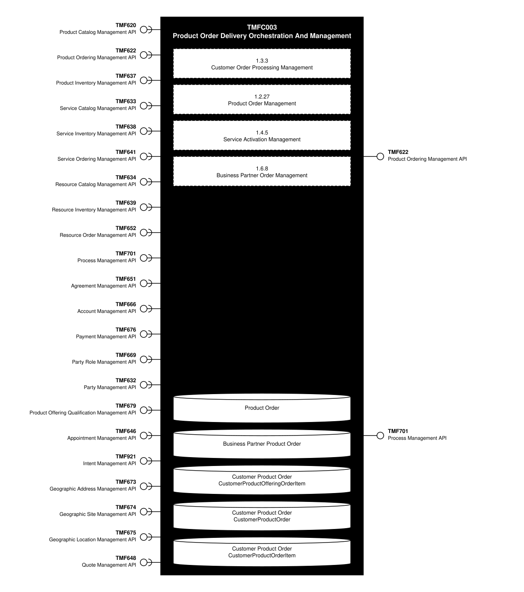
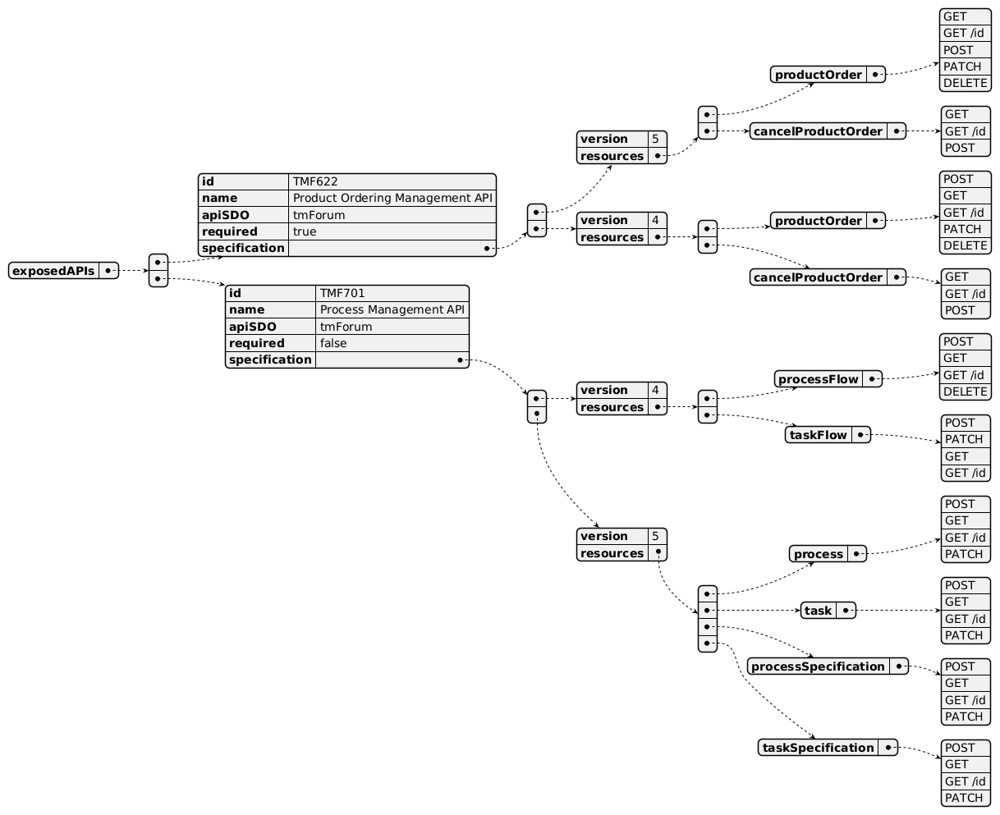
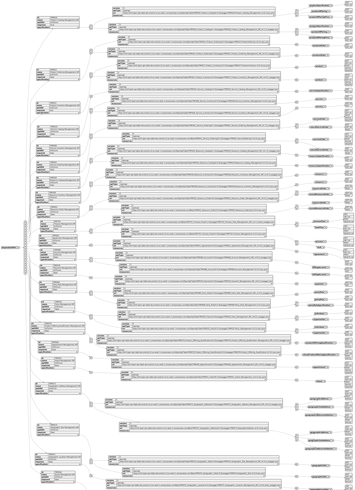
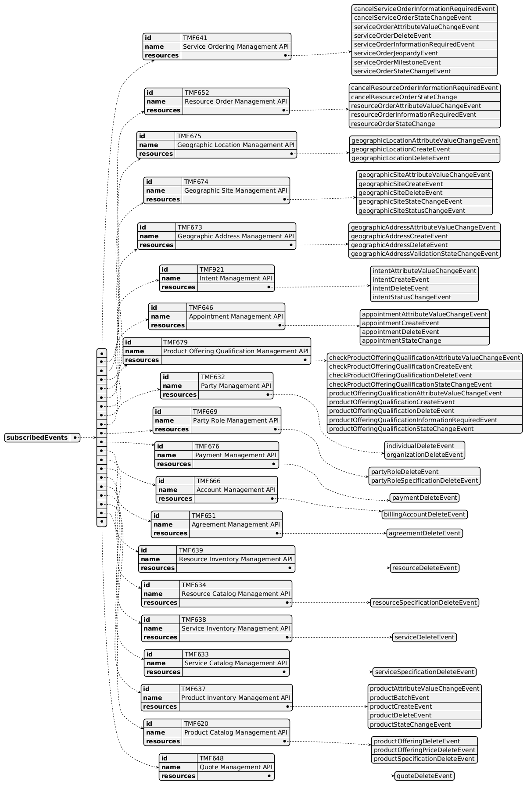

# TMFC003 – Product Order Delivery Orchestration And Management

## 1. Overview

| Component Name | ID | Description | ODA Function Block |
|---|---|---|---|
| Product Order Delivery Orchestration And Management | TMFC003 | This component orchestrates the delivery of Product Orders (status accepted). Based on the level of Product specification information available in the Product Catalog (eg prerequisite links between product specifications, links between product and CFS specifications...) it determines in which order the product specification level order items need to be delivered, and to which CFS (or Resource) specification each ordered product corresponds, and prepares and addresses each related service (or Resource) order to the production system in charge. During the delivery process execution, this component is in charge of the evolution of the status of the product specification level order items, and of the related product items, triggering updates of the related inventories. | CoreCommerce |

## 2. eTOM Processes, SID Data Entities and Functional Framework Functions

### 2.1. eTOM business activities

eTOM business activities this ODA Component is responsible for:

| Identifier | Level | Business Activity Name |
|---|---|---|
| 1.3.3 | L2 | Customer Order Processing Management |
| 1.3.3.12 | L3 | Customer Order Fulfilment |
| 1.3.3.12.1 | L4 | Manage Customer Order Fallout |
| 1.3.3.12.1 | L4 | Manage Customer Order Delivery |
| 1.3.3.15 | L3 | Manage Customer Order Completion |
| 1.3.3.16 | L3 | Manage Customer Order Management Reporting |
| 1.3.3.17 | L3 | Manage Customer Order Closure |
| 1.2.27.2 | L3 | Manage Product Order Fulfilment |
| 1.2.27.3 | L3 | Manage Product Order Delivery |
| 1.2.27.4 | L3 | Manage Product Order Cancellation |
| 1.2.27.5 | L3 | Manage Product Order Management Reports |
| 1.4.5 | L2 | Service Configuration & Activation |
| 1.4.5.6 | L3 | Issue Service Order |
| 1.5.6 | L2 | Resource Provisioning |
| 1.5.6.7 | L3 | Issue Resource Order |
| 1.6.8 | L2 | Business Partner Order Managemenrt |
| 1.6.8.1 | L3 | Issue Business Partner |

### 2.2. SID ABEs

SID ABEs this ODA Component is responsible for:

*(none listed in the component YAML)*

### 2.3. eTOM L2 - SID ABEs links

*(PlantUML source: [TMFC003_eTOM_SID.puml](TMFC003_eTOM_SID.puml))*

### 2.4. Functional Framework Functions

| Function ID | Function Name |
|---|---|
| 16 | Fallout Automated Correction |
| 17 | Fallout Correction Information Collection |
| 18 | Fallout Management to Fulfillment Application Accessing |
| 19 | Fallout Manual Correction Queuing |
| 20 | Fallout Notification |
| 21 | Fallout Orchestration |
| 22 | Fallout Reporting |
| 23 | Fallout Dashboard System Log-in Accessing |
| 24 | Pre-populated Fallout Information Presentation |
| 172 | Customer Order Reporting |
| 175 | Customer Support Jeopardy Notification |
| 174 | Customer Order Error Resolution Support |
| 178 | Customer Order Administration |
| 208 | Customer Order Change Management |
| 209 | Customer Order Cancellation |
| 211 | Customer Order Activity Supervision |
| 212 | Customer Order Versioning |
| 213 | Pending Customer Order Manteinance |
| 214 | Customer Order Orchestration |
| 215 | Retro-active order orchestration |
| 217Customer_Order_Establishment_Tracking | |
| 716 | Order Data Enrichment |
| 716 | Order-Data Enrichment |
| 717 | Calculated-Order-Data Enrichment |
| 718 | Customer Order Validation |
| 719 | Customer Order Storage |
| 720 | Customer Order Searching |
| 756 | Fallout Rule Based Error Correction |
| 1070 | Orchestration Customer Order Error Resolution |
| 1202 | Delivery Items Identification |
| 1203 | Order Preparation |
| 1325 | Customer Order Distribution |

## 3. TM Forum Open APIs & Events

The following part covers the APIs and Events; this part is split in 3:
- List of Exposed APIs - This is the list of APIs available from this component.
- List of Dependent APIs - In order to satisfy the provided API, the component could require the usage of
  this set of required APIs.
- List of Events (generated & consumed) - The events which the component may generate are listed in this
  section along with a list of the events which it may consume. Since there is a possibility of multiple
  sources and receivers for each defined event.

### 3.1. API Context Diagram

*(SVG source: [TMFC003_API_Context.svg](TMFC003_API_Context.svg) — hand-drawn rather than
PlantUML for this one diagram, since PlantUML's automatic layout couldn't give each API its own straight,
individually-anchored connector at a chosen height. Generated by the `component-specification-markdown`
skill's `scripts/render_api_context_svg.py`.)*

### 3.2. Exposed APIs

| API ID | API Name | Mandatory / Optional | API Version | Resource | Operations |
|---|---|---|---|---|---|
| TMF622 | Product Ordering Management API | Mandatory | 5 | cancelProductOrder | GET, GET /id, POST |
| TMF622 | Product Ordering Management API | Mandatory | 5 | productOrder | GET, GET /id, POST, PATCH, DELETE |
| TMF622 | Product Ordering Management API | Mandatory | 4 | productOrder | POST, GET, GET /id, PATCH, DELETE |
| TMF622 | Product Ordering Management API | Mandatory | 4 | cancelProductOrder | POST, GET, GET /id |
| TMF701 | Process Flow Management API | Optional | 4 | processFlow | POST, GET, GET /id, DELETE |
| TMF701 | Process Flow Management API | Optional | 4 | taskFlow | PATCH, GET, GET /id |

*(PlantUML source: [TMFC003_Exposed_API.yaml](TMFC003_Exposed_API.yaml))*

### 3.3. Dependent APIs

| API ID | API Name | API Version | Mandatory / Optional | Resource | Operations |
|---|---|---|---|---|---|
| TMF620 | Product Catalog Management API | 5 | Mandatory | productSpecification | GET, GET /id |
| TMF620 | Product Catalog Management API | 4 | Mandatory | productSpecification | GET, GET /id |
| TMF622 | Product Ordering Management API | 5 | Mandatory | productOrder | GET /id, PATCH |
| TMF622 | Product Ordering Management API | 4 | Mandatory | productOrder | GET /id, PATCH |
| TMF637 | Product Inventory Management API | 5 | Mandatory | product | GET, GET /id, POST, PATCH, DELETE |
| TMF637 | Product Inventory Management API | 4 | Mandatory | product | POST, GET, GET /id, PATCH, DELETE |
| TMF633 | Service Catalog Management API | 4 | Optional | serviceSpecification | GET, GET /id |
| TMF638 | Service Inventory Management API | 5 | Optional | service | GET, GET /id |
| TMF638 | Service Inventory Management API | 4 | Optional | service | GET /id, GET |
| TMF641 | Service Ordering Management API | 4 | Mandatory | serviceOrder | GET, GET /id, POST, PATCH, DELETE |
| TMF641 | Service Ordering Management API | 4 | Mandatory | cancelServiceOrder | GET, GET /id, POST |
| TMF634 | Resource Catalog Management API | 5 | Optional | resourceSpecification | GET, GET /id |
| TMF634 | Resource Catalog Management API | 4 | Optional | resourceSpecification | GET, GET /id |
| TMF639 | Resource Inventory Management API | 4 | Optional | resource | GET, GET /id |
| TMF652 | Resource Order Management API | 4 | Optional | resourceOrder | GET /id, POST |
| TMF701 | Process Flow Management API | 4 | Optional | processFlow | GET, GET /id, POST, DELETE /id |
| TMF701 | Process Flow Management API | 4 | Optional | taskFlow | GET, GET /id, PATCH /id |

*(PlantUML source: [TMFC003_Dependant_API.yaml](TMFC003_Dependant_API.yaml))*

### 3.4. Events

The diagram illustrates the Events which the component may publish and the Events that the component may
subscribe to and then may receive. Both lists are derived from the APIs listed in the preceding sections.

#### Published Events

| API ID | API Name | Event Resources |
|---|---|---|
| TMF622 | Product Ordering Management API | productOrderStateChange, productOrderCreateEvent, productOrderAttributeValueChange, productOrderDelete, productOrderInformationRequired, cancelProductOrderCreateEvent, cancelProductOrderStateChange, cancelProductOrderInformationRequired |
| TMF701 | Process Flow Management API | processFlowCreateEvent, processFlowStateChangeEvent, processFlowStateDeleteEvent, processFlowStateAttributeValueChangeEvent, taskFlowCreateEvent, taskFlowStateChangeEvent, taskFlowDeleteEvent, taskFlowAttributeValueChangeEvent, taskFlowInformationRequiredEvent |

*(PlantUML source: [TMFC003_Published_Events.yaml](TMFC003_Published_Events.yaml))*

#### Subscribed Events

| API ID | API Name | Event Resources |
|---|---|---|
| TMF641 | Service Ordering Management API | serviceOrderStateChangeEvent, serviceOrderAttributeValueChangeEvent, serviceOrderInformationRequiredEvent, serviceOrderMilestoneEvent, serviceOrderJeopardyEvent, cancelServiceOrderStateChangeEvent, cancelServiceOrderInformationRequiredEvent |
| TMF652 | Resource Order Management API | resourceOrderStateChange, resourceOrderAttributeValueChangeEvent, resourceOrderInformationRequiredEvent, cancelResourceOrderStateChange, cancelResourceOrderInformationRequiredEvent |

*(PlantUML source: [TMFC003_Subscribed_Events.yaml](TMFC003_Subscribed_Events.yaml))*

## 4. Machine Readable Component Specification

Refer to the ODA Component Directory on the TM Forum website for the machine-readable component
specification files for this component.

## 5. References

### 5.1. TMF Standards related versions

| Standard | Version(s) |
|---|---|
| eTOM | v23.0 |
| SID | n/a |
| Functional Framework | v23.0 |
