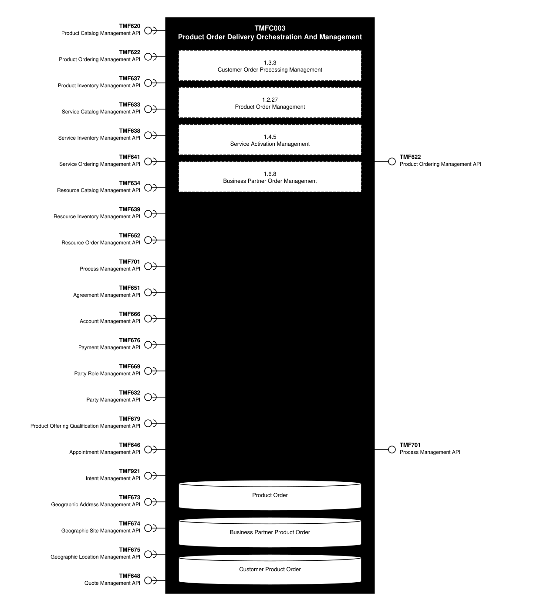
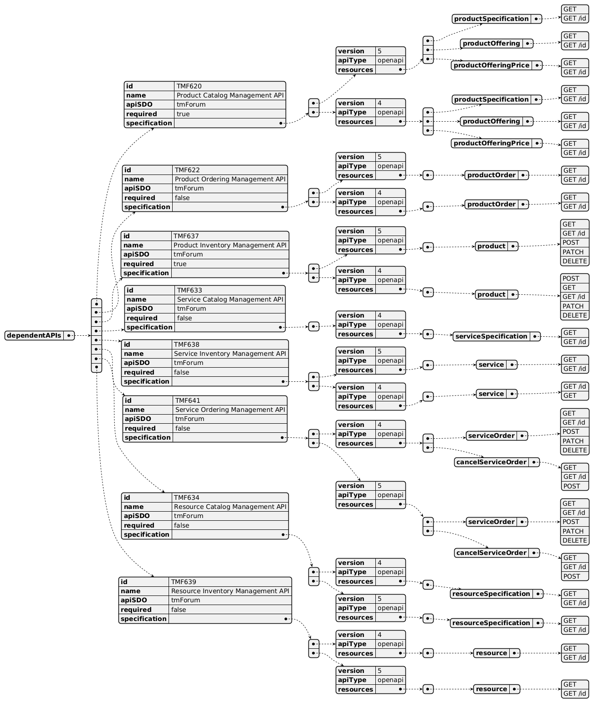
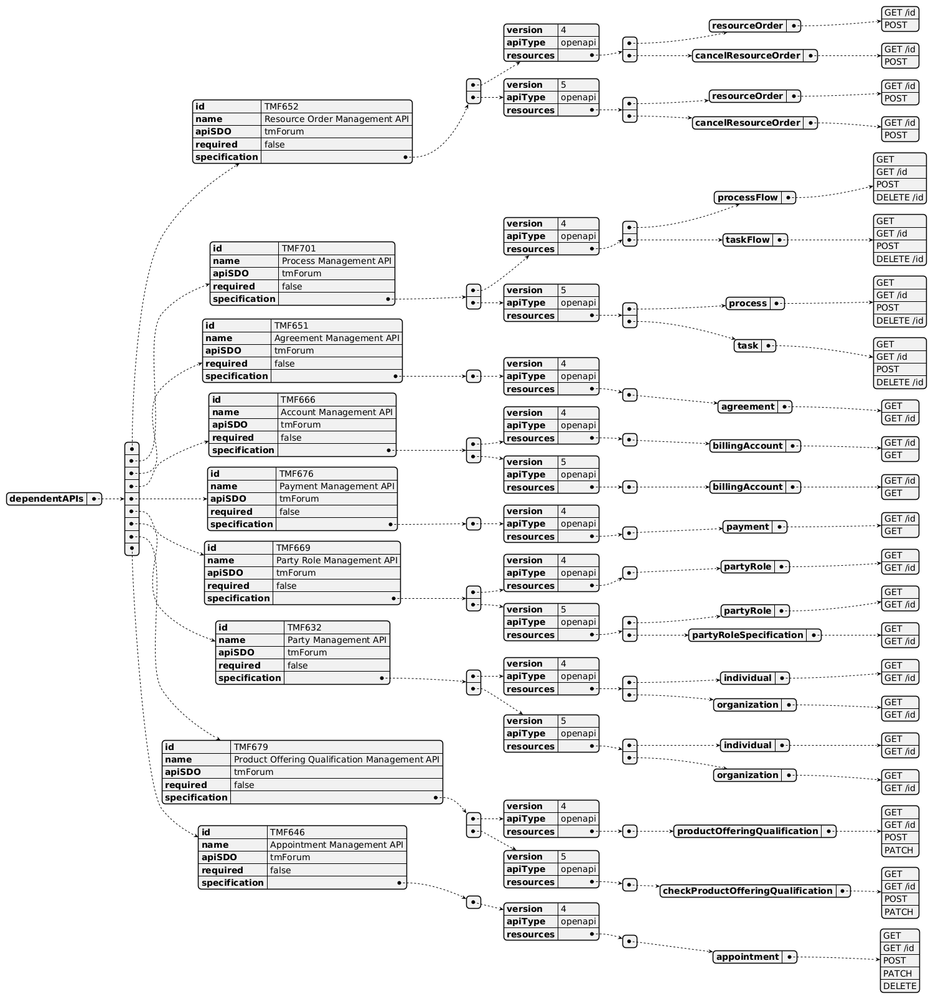
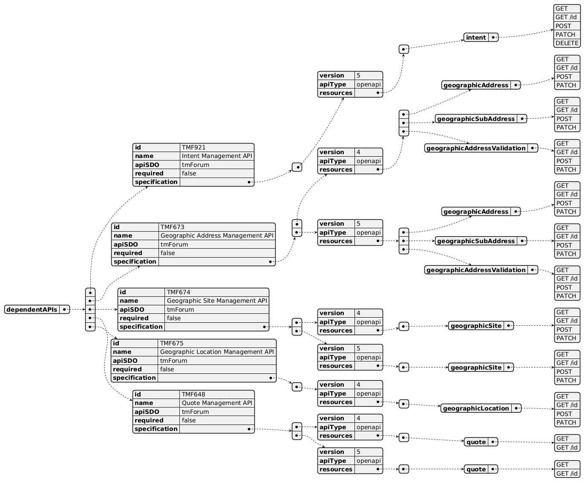
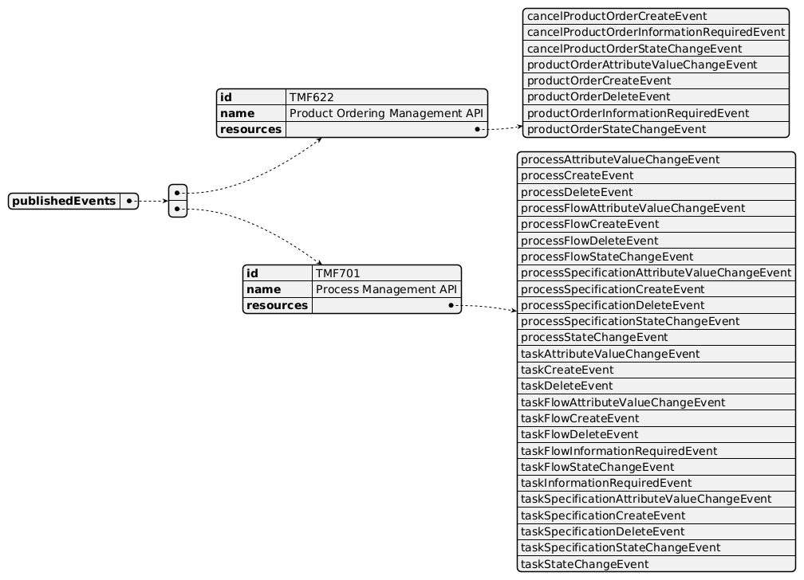

# TMFC003 – Product Order Delivery Orchestration And Management

## 1. Overview

| Component Name | ID | Description | ODA Function Block |
|---|---|---|---|
| Product Order Delivery Orchestration And Management | TMFC003 | This component manages, orchestrates, and delivers Product Orders. | CoreCommerce |

## 2. eTOM Processes, SID Data Entities and Functional Framework Functions

### 2.1. eTOM business activities

eTOM business activities this ODA Component is responsible for:

| Identifier | Level | Business Activity Name | Description |
|---|---|---|---|
| 1.3.3 | L2 | Customer Order Processing Management | Customer Order Processing Management business process directs and controls all activities that operationally realize orders for customer. / Customer Order Processing Management assures the capture, processing, fulfillment, "shipping", delivery and reporting of customer orders from feasibility assessment, purchasing, payment, fulfillment and follow up with the customer for closure. |
| 1.2.27 | L2 | Product Order Management | Product Order Management business direct and control processes that capture, track, fulfil, deliver and close product order requests. |
| 1.4.5 | L2 | Service Activation Management | Allocation, implementation, configuration, activation and testing of specific services to meet customer requirements. |
| 1.4.5.6 | L3 | Issue Service Order | Issue correct and complete service orders. |
| 1.6.8 | L2 | Business Partner Order Management | Track, monitor and report on an order to another Business Partner to ensure that the interactions are in accordance with the agreed commercial agreements with the other Business Partner. |

### 2.2. SID ABEs

SID ABEs this ODA Component is responsible for:

| SID ABE Level 1 | SID ABE Level 2 | Description |
|---|---|---|
| Product Order |  | The Product Order ABE contains all entities required to specify a communication used to procure or update one or many Products and ProductOfferingInstances in the context of ProductSpecifications and ProductOfferingSpecifications. This pattern is used to define: CustomerProductOrder corresponding to ProductOfferingInstances ordered by a Customer from the Service Provider and BusinessPartnerProductOrder corresponding to ProductOfferingInstances ordered by the Service Provider from a Business Partner Note: Some but not all enterprises consider an Order to be a type of an Agreement. From a SID model perspective, an Order can be formalized by an Agreement and the Agreements relationship between the Agreement and the ProductOrder. This philosophy has the advantage of clearly separating two different concepts: the order from the legal formalisms associated with the order. For example, several orders may refer to the same Agreement. |
| Business Partner Product Order |  | The Business Partner Product Order ABE contains all entities required to specify a communication used to procure, update or remove one or many ProductOfferingInstances in the context of a ProductOfferingSpecification for the Service Provider. A Business Partner Product Order is also known as a Purchase Order. Note: Some but not all enterprises consider an Order to be a type of an Agreement. From a SID model perspective, an Order can be formalized by an Agreement and the Agreements relationship between the Agreement and the ProductOrder. This philosophy has the advantage of clearly separating two different concepts: the order from the legal formalisms associated with the order. For example, several orders may refer to the same Agreement. |
| Customer Product Order | CustomerProductOfferingOrderItem | A CustomerProductOfferingOrderItem is a specializaiton of ProductOfferingOrderItem. Each CustomerProductOfferingOrderItem requires an action (AllowedProductAction) on a ProductOffering. |
| Customer Product Order | CustomerProductOrder | A Customer might place orders with the Service Provider. This is represented by the CustomerProductOrder. CustomerProductOrder / CustomerProductOfferingOrderItem / CustomerProductOrderItem are sub-classes from ProductOrder / ProductOfferingOrderItem / ProductOrderItem. For further details about PartyOrder / PartyOfferingOrderItem / PartyOrderItem refer to the Business Partner guide book. A CustomerProductOrder represents a communication used to procure or update one or many ProductOfferingInstances in the context of a ProductOfferingSpecification through all its CustomerProductOfferingOrderItems. The particularity of the CustomerProductOrder is to procure or update ProductOfferingInstances for Customer even if the CustomerProductOrder might be placed by the Service Provider when applying precautionary measures in case of bad debt. |
| Customer Product Order | CustomerProductOrderItem | Each CustomerProductOrderItem requires an action (AllowedProductAction) on a ProductSpecification. |

### 2.3. eTOM L2 - SID ABEs links

*(no eTOM–SID links recorded for this component in `TMFC003_eTOM_SID_Links.md`)*

### 2.4. Functional Framework Functions

| Function ID | Function Name | Function Description | Aggregate Function Level 1 | Aggregate Function Level 2 |
|---|---|---|---|---|
| 16 | Fallout Automated Correction | Fallout Automated Correction function tries to automatically fix fallouts in workflows before they go to a human for handling. / This includes a Fallout Rules Engine that provides the capability to handling various errors or error types based on built rules. These rules can facilitate autocorrection, correction assistance, placement of errors in the appropriate queues for manual handling, as well as access to various systems. | Fallout Management | Fallout Correction Management |
| 17 | Fallout Correction Information Collection | Fallout Correction Information Collection collects relevant information for errors or situations that cannot be handled via Fallout Auto Correction. The intent is to reduce the time required by the technician in diagnosing and fixing the fallout. | Fallout Management | Fallout Correction Management |
| 18 | Fallout Management to Fulfillment Application Accessing | Fallout Management to Fulfillment Application Accessing function provides a variety of tools to facilitate Fallout Management access to other applications and repositories to facilitate proper Fallout Management. This can include various general access techniques such as messaging, publish and subscribe, etc. as well as specific APIs and contracts to perform specific queries or updates to various applications or repositories within the fulfillment domain. | Fallout Management | Fallout Repository Management |
| 19 | Fallout Manual Correction Queuing | Fallout Manual Correction Queuing function provides the required functionality to place error fallout into appropriate queues to be handled via various staff or workgroups assigned to handle or fix the various types of fallout that occurs during the fulfillment process. This includes the ability to create and configure queues, route errors to the appropriate queues, as well as the ability for staff to access and address the various fallout instances within the queues. | Fallout Management | Fallout Correction Management |
| 20 | Fallout Notification | Fallout Notification function provides the means to alert people or workgroups of some fallout situation. This can be done via a number of means, including email, paging, (Fallout management interface bus) etc. This function is done via business rules. | Fallout Management | Fallout Repository Management |
| 21 | Fallout Orchestration | The Fallout Orchestration function provides workflow and orchestration capability across Fallout Management. | Fallout Management | Fallout Correction Management |
| 22 | Fallout Reporting | Fallout Reporting provides various reports regarding Fallout Management, including statistics on fallout per various times periods (per hour, week, month, etc) as well as information about specific fallout. | Fallout Management | Fallout Repository Management |
| 23 | Fallout Dashboard System Log-in Accessing | Fallout Dashboard System Log-in Accessing provides auto logon capability into various applications needed to analyze and fix fallout | Fallout Management | Fallout Repository Management |
| 24 | Pre-populated Fallout Information Presentation | Pre-populated Fallout Information Presentation automatically position the analyzer on appropriate screens pre-populated with information about the order(s) that's subject for fallout handling. | Fallout Management | Fallout Correction Management |
| 120 | Customer Order Capturing | Customer Order Capturing provides access to order capture and negotiation capabilities. Takes care of persistence using Customer Order Repository Management. Including support of contract printing, integration with a locally installed cash management/cash register and a retail inventory system for order completion and ordered product versioning. | Product Configuration & Activation | Offer and Product Configuration |
| 172 | Customer Order Reporting | Customer Order Reporting function provides front end support for Business, Financial and Operational reporting and analyzing of the ordering activities. | Customer Order Management | Customer Order Repository Management |
| 174 | Ordering Customer Order Error Resolution | Customer Order Error Resolution Support provides to view pool of orders resulted in error or stuck orders and enable the Customer Support to act accordingly (e.g., resend the request, notify the user with recommended action) | Customer Order Management | Customer Order Repository Management |
| 175 | Customer Support Jeopardy Notification | Customer Support Jeopardy Notification provide to view jeopardy notifications queue and enable the Customer Support to act accordingly (e.g., notify customer on due date delay) | Customer Order Management | Customer Order Repository Management |
| 177 | Customer Order Take-over Management | Customer Order Take-over Management provides an ability to take over governance of orders handled by other channels (e.g. self service) amend and relinquish, while preserving all the captured data. | Customer Order Management | Customer Order Completion |
| 178 | Customer Order Administration | Customer Order Administration provide to view all outstanding orders, progress and history displays | Customer Order Management | Customer Order Repository Management |
| 181 | Product Order Data Collection | Product Order Data Collection provides an aid in verification and issuance of a complete and valid customer order. This function checks delivery address, link with a payment, a billing account, a certified holder, etc. | Customer Order Management | Customer Order Completion |
| 204 | Customer Order Entry Finalization | The Customer Order Entry Finalization function enables finalization the Customer Order with collection of Customer Data or installed base data according to the Catalog. It allows to complete the configuration element not necessary for the quotation. The complements could also concern links with actors, dates, address, billing account. | Customer Order Management | Customer Order Completion |
| 205 | Customer Order Eligibility Validation | Customer Order Eligibility Validation function validates that the Offer & products specified on the Customer Order, are eligible from a commercial and functional point of view. It includes: - Commercial Eligibility with commercial compatibility with the already customer installed Products (corresponding to ProductOffering) - Functional Eligibility with the customer's already installed Products (corresponding to ProductSpecification). | Customer Order Management | Customer Order Commercial Eligibility |
| 208 | Customer Order Change Management | Customer Order Change Management amend pending order resulted from customer change requests or provisioning system limitation and revalidate the order. | Customer Order Management | Customer Order Change Management |
| 209 | Customer Order Cancellation | Customer Order Cancellation can optionally support Cancel for order completed by Service Order Management (this capability is dependent on the Service Order Management system’s ability to roll back service provisioning). This function assesses the feasibility of order cancellation and the potential charge to the customer. If the cancellation is confirmed, it proceeds with the cancellation. | Customer Order Management | Customer Order Validation |
| 211 | Customer Order Activity Supervision | Customer Order Activity Supervision governs the control of the order amongst the ordering channels. This allows keeping the order data consistency, sharing the order data among order application channels, and alternating the control between them. | Customer Order Management | Customer Order Repository Management |
| 212 | Customer Order Versioning | Customer Order Versioning maintains order versioning including Tracking & Logging of the changes made to a purchased product. | Customer Order Management | Customer Order Repository Management |
| 213 | Pending Customer Order Maintenance | Pending Customer Orders Maintenance saves the order/quote for future processing (in case the customer is not sure if they want to go through with the order at this point) | Customer Order Management | Customer Order Repository Management |
| 214 | Customer Order Orchestration | The Customer Order Orchestration function provides workflow and orchestration capabilities at the Product Order Item level for a dedicated Customer Order. / Customer Order Orchestration function identifies Service Order Items (CFS level) according to Order Items of the Customer Order, sequences Service Order Items and distributes the Service Order requests to appropriate systems. For example : Service Order Management (SOM), potential 3rd parties, ... / This identification of Service Order Items relies on : / - the articulation between ProductSpecifications and CFSSpec described in the Catalogue Repository / - the articulation between Product Operations and CFS Operations described in the Catalogue Repository / - existing installed CFS / - the potential rules of choice if several CFS can fit in with the product. / Orchestration can take into account : / - constraints between Customer Product Order Items inside the Customer Product Order, or successive Customer Orders including modification or cancellation (in-flight changes) / - any type of business rules based on information even external to the Customer Product Order. For example : high level of priority for VIP customers / - Triggering of exception process or delivery planning update, depending on Customer Product Order or Service Order events. | Customer Order Management | Customer Order Orchestration |
| 215 | Retro-active order orchestration | Retro-active Order Orchestration provides submission of a retroactive order with a past effective date (e.g., retroactive price plan change) and the handling of manual intervention requests (for order fallouts). | Customer Order Management | Customer Order Orchestration |
| 217 | Customer Order Establishment Tracking | Customer Order Establishment Tracking provides the functionality necessary to track and manage the distributed requests decomposed by Customer Order Orchestration. | Customer Order Management | Customer Order Repository Management |
| 366 | Customer Order Management | Customer Order Management provides an online access function to specific orders, to be used for management, monitoring and tracking for customer support and external agents for Upgrade of customer’s products/services. | Customer Order Management | Customer Order Repository Management |
| 647 | Partner Order Management | Partner Order Management tracks, monitors and reports on a service provider initiated order to ensure that the interactions are in accordance with the agreed commercial arrangements between the service provider and another party. | Business Partner Order Management | Business Partner Order Validation |
| 716 | Order-Data Enrichment | Order Data Enrichment function acquire missing order data from surrounding systems (often values taken from catalogs and inventories, billing, fraud, etc.) or from external 3rd party systems (like country's common address or credit check system). | Customer Order Management | Customer Order Completion |
| 717 | Calculated Order Data Enrichment | Calculated Order Data Enrichment calculates missing order data values on-the-fly from existing data and ordering rules. E.g., Contract end dates, Discounted period, etc. | Customer Order Management | Customer Order Completion |
| 718 | Customer Order Validation | Customer Order Validation Function ensures that the qualified order is valid in any moment of order lifecycle, usually as data become available. Validation ensures early fallout which is less costly than encountering errors in later stages of order handling. | Customer Order Management | Customer Order Validation |
| 719 | Customer Order Storage | The Customer Order Storage function stores the valid and complete customer orders into an appropriate data storage. | Customer Order Management | Customer Order Repository Management |
| 720 | Customer Order Searching | Customer Order Searching function makes the customer orders available to other applications. |  |  |
| 756 | Fallout Rule Based Error Correction | Fallout Rule Based Error Correction function provides the capability to handle various errors or error types based on pre-defined rules. These rules can facilitate autocorrection | Fallout Management | Fallout Correction Management |
| 1070 | Orchestration Customer Order Error Resolution | Orchestration Customer Order Error Resolution provides to view pool of orders resulted in error or stuck orders during orchestration and enable the Customer Support to act accordingly. / For example, a delay change because of resource unavailability or appointment not respected may trigger the resend of the request or notify the user with recommended action. | Customer Order Management | Customer Order Orchestration |
| 1123 | Customer Order Initialization | The Customer Order Initialization Function creates a Customer Order (either unpopulated and ready for entry of order items, or initialized with the products and identified features of a selected offer). The Customer Order thus created can be added to, deleted from, or further specified up until the Customer Order has been completed and confirmed. This Process was renamed in 24.5 old name was Product Order Initialization | Product Configuration & Activation | Offer and Product Configuration |
| 1172 | Business Partner Order Storage Management | Business Partner Order Storage Management Function is in charge of tracking Business Partner Orders for each version. | Business Partner Order Management | Business Partner Order Repository Management |
| 1173 | Business Partner Order Lifecycle Management | Business Partner Order Lifecycle Management collects Business Partner Order events and manages Business Partner Orders lifecycle. | Business Partner Order Management | Business Partner Order Repository Management |
| 1202 | Delivery Items Identification | The Delivery Items Identification function allows in the context of a customer order to consult catalogs and installed bases to identify what needs to be delivered: Service Specification (CFS Spec) and its configuration, Stock Item, Supplier Product, Work Spec, related to the ordered product. | Customer Order Management | Customer Order Delivery Preparation |
| 1203 | Order Preparation | The Order Preparation Function allows in the context of a customer order to prepare a Service Order, Supplier Order, Stock Item Order or Work Order with the necessary information. / In the case of a Product associated with an Internal Service (Know-How), this function also allows to: / • check if a corresponding Installed CFS is operational in the Service Installed Base, and so determine the operation at CFS level (creation or modification) / • possibly group in the same Service Order several ordered product, based on the same CFS specification, and/or identified to be delivered at the same time by the Customer Order Delivery Orchestration. | Customer Order Management | Customer Order Delivery Preparation |
| 1325 | Customer Order Distribution | Customer Order Distribution function enables distributing finalized customer orders to any parties and systems that need the order information and/or the notification that the order has been finalized. | Customer Order Management | Customer Order Completion |

## 3. TM Forum Open APIs & Events

The following part covers the APIs and Events; this part is split in 3:
- List of Exposed APIs - This is the list of APIs available from this component.
- List of Dependent APIs - In order to satisfy the provided API, the component could require the usage of
  this set of required APIs.
- List of Events (generated & consumed) - The events which the component may generate are listed in this
  section along with a list of the events which it may consume. Since there is a possibility of multiple
  sources and receivers for each defined event.

### 3.1. API Context Diagram

*(SVG source: [TMFC003_API_Context.svg](TMFC003_API_Context.svg) — hand-drawn rather than
PlantUML for this one diagram, since PlantUML's automatic layout couldn't give each API its own straight,
individually-anchored connector at a chosen height. Generated by the `component-specification-documentation`
skill's `scripts/render_api_context_svg.py`.)*

### 3.2. Exposed APIs

| API ID | API Name | Mandatory / Optional | API Version | Resource | Operations |
|---|---|---|---|---|---|
| TMF622 | Product Ordering Management API | Mandatory | 5 | productOrder | GET GET /id POST PATCH DELETE |
| TMF622 | Product Ordering Management API | Mandatory | 5 | cancelProductOrder | GET GET /id POST |
| TMF622 | Product Ordering Management API | Mandatory | 4 | productOrder | POST GET GET /id PATCH DELETE |
| TMF622 | Product Ordering Management API | Mandatory | 4 | cancelProductOrder | GET GET /id POST |
| TMF701 | Process Management API | Optional | 4 | processFlow | POST GET GET /id DELETE |
| TMF701 | Process Management API | Optional | 4 | taskFlow | POST PATCH GET GET /id |
| TMF701 | Process Management API | Optional | 5 | process | POST GET GET /id PATCH |
| TMF701 | Process Management API | Optional | 5 | task | POST GET GET /id PATCH |
| TMF701 | Process Management API | Optional | 5 | processSpecification | POST GET GET /id PATCH |
| TMF701 | Process Management API | Optional | 5 | taskSpecification | POST GET GET /id PATCH |

*(PlantUML source: [TMFC003_Exposed_API.yaml](TMFC003_Exposed_API.yaml))*

### 3.3. Dependent APIs

| API ID | API Name | API Version | Mandatory / Optional | Resource | Operations |
|---|---|---|---|---|---|
| TMF620 | Product Catalog Management API | 5 | Mandatory | productSpecification | GET GET /id |
| TMF620 | Product Catalog Management API | 5 | Mandatory | productOffering | GET GET /id |
| TMF620 | Product Catalog Management API | 5 | Mandatory | productOfferingPrice | GET GET /id |
| TMF620 | Product Catalog Management API | 4 | Mandatory | productSpecification | GET GET /id |
| TMF620 | Product Catalog Management API | 4 | Mandatory | productOffering | GET GET /id |
| TMF620 | Product Catalog Management API | 4 | Mandatory | productOfferingPrice | GET GET /id |
| TMF622 | Product Ordering Management API | 5 | Optional | productOrder | GET GET /id |
| TMF622 | Product Ordering Management API | 4 | Optional | productOrder | GET GET /id |
| TMF637 | Product Inventory Management API | 5 | Mandatory | product | GET GET /id POST PATCH DELETE |
| TMF637 | Product Inventory Management API | 4 | Mandatory | product | POST GET GET /id PATCH DELETE |
| TMF633 | Service Catalog Management API | 4 | Optional | serviceSpecification | GET GET /id |
| TMF638 | Service Inventory Management API | 5 | Optional | service | GET GET /id |
| TMF638 | Service Inventory Management API | 4 | Optional | service | GET /id GET |
| TMF641 | Service Ordering Management API | 4 | Optional | serviceOrder | GET GET /id POST PATCH DELETE |
| TMF641 | Service Ordering Management API | 4 | Optional | cancelServiceOrder | GET GET /id POST |
| TMF641 | Service Ordering Management API | 5 | Optional | serviceOrder | GET GET /id POST PATCH DELETE |
| TMF641 | Service Ordering Management API | 5 | Optional | cancelServiceOrder | GET GET /id POST |
| TMF634 | Resource Catalog Management API | 4 | Optional | resourceSpecification | GET GET /id |
| TMF634 | Resource Catalog Management API | 5 | Optional | resourceSpecification | GET GET /id |
| TMF639 | Resource Inventory Management API | 4 | Optional | resource | GET GET /id |
| TMF639 | Resource Inventory Management API | 5 | Optional | resource | GET GET /id |
| TMF652 | Resource Order Management API | 4 | Optional | resourceOrder | GET /id POST |
| TMF652 | Resource Order Management API | 4 | Optional | cancelResourceOrder | GET /id POST |
| TMF652 | Resource Order Management API | 5 | Optional | resourceOrder | GET /id POST |
| TMF652 | Resource Order Management API | 5 | Optional | cancelResourceOrder | GET /id POST |
| TMF701 | Process Management API | 4 | Optional | processFlow | GET GET /id POST DELETE /id |
| TMF701 | Process Management API | 4 | Optional | taskFlow | GET GET /id POST DELETE /id |
| TMF701 | Process Management API | 5 | Optional | process | GET GET /id POST DELETE /id |
| TMF701 | Process Management API | 5 | Optional | task | GET GET /id POST DELETE /id |
| TMF651 | Agreement Management API | 4 | Optional | agreement | GET GET /id |
| TMF666 | Account Management API | 4 | Optional | billingAccount | GET /id GET |
| TMF666 | Account Management API | 5 | Optional | billingAccount | GET /id GET |
| TMF676 | Payment Management API | 4 | Optional | payment | GET /id GET |
| TMF669 | Party Role Management API | 4 | Optional | partyRole | GET GET /id |
| TMF669 | Party Role Management API | 5 | Optional | partyRole | GET GET /id |
| TMF669 | Party Role Management API | 5 | Optional | partyRoleSpecification | GET GET /id |
| TMF632 | Party Management API | 4 | Optional | individual | GET GET /id |
| TMF632 | Party Management API | 4 | Optional | organization | GET GET /id |
| TMF632 | Party Management API | 5 | Optional | individual | GET GET /id |
| TMF632 | Party Management API | 5 | Optional | organization | GET GET /id |
| TMF679 | Product Offering Qualification Management API | 4 | Optional | productOfferingQualification | GET GET /id POST PATCH |
| TMF679 | Product Offering Qualification Management API | 5 | Optional | checkProductOfferingQualification | GET GET /id POST PATCH |
| TMF646 | Appointment Management API | 4 | Optional | appointment | GET GET /id POST PATCH DELETE |
| TMF921 | Intent Management API | 5 | Optional | intent | GET GET /id POST PATCH DELETE |
| TMF673 | Geographic Address Management API | 4 | Optional | geographicAddress | GET GET /id POST PATCH |
| TMF673 | Geographic Address Management API | 4 | Optional | geographicSubAddress | GET GET /id POST PATCH |
| TMF673 | Geographic Address Management API | 4 | Optional | geographicAddressValidation | GET GET /id POST PATCH |
| TMF673 | Geographic Address Management API | 5 | Optional | geographicAddress | GET GET /id POST PATCH |
| TMF673 | Geographic Address Management API | 5 | Optional | geographicSubAddress | GET GET /id POST PATCH |
| TMF673 | Geographic Address Management API | 5 | Optional | geographicAddressValidation | GET GET /id POST PATCH |
| TMF674 | Geographic Site Management API | 4 | Optional | geographicSite | GET GET /id POST PATCH |
| TMF674 | Geographic Site Management API | 5 | Optional | geographicSite | GET GET /id POST PATCH |
| TMF675 | Geographic Location Management API | 4 | Optional | geographicLocation | GET GET /id POST PATCH |
| TMF648 | Quote Management API | 4 | Optional | quote | GET GET /id |
| TMF648 | Quote Management API | 5 | Optional | quote | GET GET /id |

*(PlantUML source: [TMFC003_Dependant_API_1.yaml](TMFC003_Dependant_API_1.yaml) — split across 3
diagrams since the full dependent-API list has more than 60 operations combined; see the following two
diagrams for the rest.)*

*(PlantUML source: [TMFC003_Dependant_API_2.yaml](TMFC003_Dependant_API_2.yaml))*

*(PlantUML source: [TMFC003_Dependant_API_3.yaml](TMFC003_Dependant_API_3.yaml))*

### 3.4. Events

The diagram illustrates the Events which the component may publish and the Events that the component may
subscribe to and then may receive. Both lists are derived from the APIs listed in the preceding sections.

#### Published Events

| API ID | API Name | Event Resources |
|---|---|---|
| TMF622 | Product Ordering Management API | cancelProductOrderCreateEvent cancelProductOrderInformationRequiredEvent cancelProductOrderStateChangeEvent productOrderAttributeValueChangeEvent productOrderCreateEvent productOrderDeleteEvent productOrderInformationRequiredEvent productOrderStateChangeEvent |
| TMF701 | Process Management API | processAttributeValueChangeEvent processCreateEvent processDeleteEvent processFlowAttributeValueChangeEvent processFlowCreateEvent processFlowDeleteEvent processFlowStateChangeEvent processSpecificationAttributeValueChangeEvent processSpecificationCreateEvent processSpecificationDeleteEvent processSpecificationStateChangeEvent processStateChangeEvent taskAttributeValueChangeEvent taskCreateEvent taskDeleteEvent taskFlowAttributeValueChangeEvent taskFlowCreateEvent taskFlowDeleteEvent taskFlowInformationRequiredEvent taskFlowStateChangeEvent taskInformationRequiredEvent taskSpecificationAttributeValueChangeEvent taskSpecificationCreateEvent taskSpecificationDeleteEvent taskSpecificationStateChangeEvent taskStateChangeEvent |

*(PlantUML source: [TMFC003_Published_Events.yaml](TMFC003_Published_Events.yaml))*

#### Subscribed Events

| API ID | API Name | Event Resources |
|---|---|---|
| TMF620 | Product Catalog Management API | productOfferingDeleteEvent productOfferingPriceDeleteEvent productSpecificationDeleteEvent |
| TMF632 | Party Management API | individualDeleteEvent organizationDeleteEvent |
| TMF633 | Service Catalog Management API | serviceSpecificationDeleteEvent |
| TMF634 | Resource Catalog Management API | resourceSpecificationDeleteEvent |
| TMF637 | Product Inventory Management API | productAttributeValueChangeEvent productBatchEvent productCreateEvent productDeleteEvent productStateChangeEvent |
| TMF638 | Service Inventory Management API | serviceDeleteEvent |
| TMF639 | Resource Inventory Management API | resourceDeleteEvent |
| TMF641 | Service Ordering Management API | cancelServiceOrderInformationRequiredEvent cancelServiceOrderStateChangeEvent serviceOrderAttributeValueChangeEvent serviceOrderDeleteEvent serviceOrderInformationRequiredEvent serviceOrderJeopardyEvent serviceOrderMilestoneEvent serviceOrderStateChangeEvent |
| TMF646 | Appointment Management API | appointmentAttributeValueChangeEvent appointmentCreateEvent appointmentDeleteEvent appointmentStateChange |
| TMF648 | Quote Management API | quoteDeleteEvent |
| TMF651 | Agreement Management API | agreementDeleteEvent |
| TMF652 | Resource Order Management API | cancelResourceOrderInformationRequiredEvent cancelResourceOrderStateChange resourceOrderAttributeValueChangeEvent resourceOrderInformationRequiredEvent resourceOrderStateChange |
| TMF666 | Account Management API | billingAccountDeleteEvent |
| TMF669 | Party Role Management API | partyRoleDeleteEvent partyRoleSpecificationDeleteEvent |
| TMF673 | Geographic Address Management API | geographicAddressAttributeValueChangeEvent geographicAddressCreateEvent geographicAddressDeleteEvent geographicAddressValidationStateChangeEvent |
| TMF674 | Geographic Site Management API | geographicSiteAttributeValueChangeEvent geographicSiteCreateEvent geographicSiteDeleteEvent geographicSiteStateChangeEvent geographicSiteStatusChangeEvent |
| TMF675 | Geographic Location Management API | geographicLocationAttributeValueChangeEvent geographicLocationCreateEvent geographicLocationDeleteEvent |
| TMF676 | Payment Management API | paymentDeleteEvent |
| TMF679 | Product Offering Qualification Management API | checkProductOfferingQualificationAttributeValueChangeEvent checkProductOfferingQualificationCreateEvent checkProductOfferingQualificationDeleteEvent checkProductOfferingQualificationStateChangeEvent productOfferingQualificationAttributeValueChangeEvent productOfferingQualificationCreateEvent productOfferingQualificationDeleteEvent productOfferingQualificationInformationRequiredEvent productOfferingQualificationStateChangeEvent |
| TMF921 | Intent Management API | intentAttributeValueChangeEvent intentCreateEvent intentDeleteEvent intentStatusChangeEvent |

*(PlantUML source: [TMFC003_Subscribed_Events.yaml](TMFC003_Subscribed_Events.yaml))*

## 4. Machine Readable Component Specification

Refer to the ODA Component Directory on the TM Forum website for the machine-readable component
specification files for this component.

## 5. References

### 5.1. TMF Standards related versions

| Standard | Version(s) |
|---|---|
| eTOM | v25.5 |
| SID | v25.5 |
| Functional Framework | v23.0, v25.5 |
